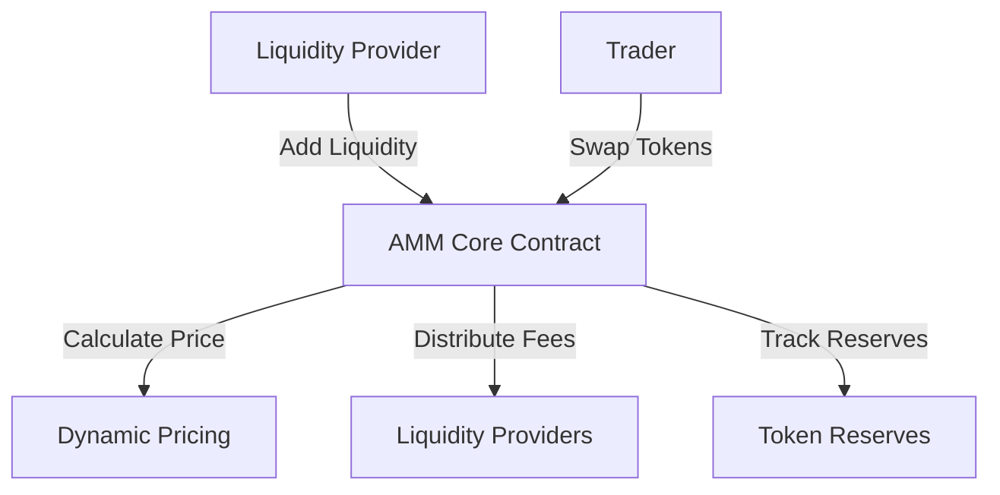

# AMM Deploy

A comprehensive Automated Market Maker (AMM) smart contract implementation for decentralized token exchanges on the Stacks blockchain.

## Overview

AMM Deploy provides a robust and secure platform for creating and managing liquidity pools, enabling seamless token swaps with minimal slippage and fair pricing mechanisms.

## Key Features

- Automated liquidity pool creation
- Token swapping with low slippage
- Dynamic fee distribution
- Permissionless pool deployment
- Advanced mathematical pricing models

## Architecture

The AMM platform is built around a core smart contract that manages liquidity pools, token exchanges, and fee calculations.



### Key Components
- **Liquidity Providers**: Add tokens to pools and earn fees
- **Traders**: Swap tokens with minimal slippage
- **Dynamic Pricing**: Algorithmic price determination
- **Fee Mechanism**: Proportional reward distribution
- **Token Reserves**: Real-time tracking of pool balances

## Contract Documentation

### AMM Core Contract

The main contract (`amm-core.clar`) manages all AMM functionality:

#### Key Functions

##### Liquidity Management
```clarity
(define-public (add-liquidity (token1 uint) (token2 uint))
(define-public (remove-liquidity (liquidity-tokens uint))
```

##### Token Swapping
```clarity
(define-public (swap-exact-tokens-for-tokens (amount-in uint) (min-amount-out uint))
(define-public (swap-tokens-for-exact-tokens (max-amount-in uint) (amount-out uint))
```

##### Pool Operations
```clarity
(define-public (create-pair (token1 principal) (token2 principal))
(define-read-only (get-reserves (token1 principal) (token2 principal))
```

## Getting Started

### Prerequisites
- Clarinet
- Stacks wallet
- Basic understanding of decentralized exchanges

### Installation

1. Clone the repository
2. Install dependencies
```bash
clarinet integrate
```

### Usage Examples

1. Create a token pair:
```clarity
(contract-call? .amm-core create-pair 'TOKEN1 'TOKEN2)
```

2. Add liquidity:
```clarity
(contract-call? .amm-core add-liquidity u1000 u2000)
```

3. Swap tokens:
```clarity
(contract-call? .amm-core swap-exact-tokens-for-tokens u500 u450)
```

## Security Considerations

1. Liquidity Risks
   - Impermanent loss awareness
   - Diversified pool strategies

2. Smart Contract Security
   - Comprehensive testing
   - External security audits
   - Upgrade mechanisms

3. Economic Considerations
   - Dynamic fee calculations
   - Slippage protection
   - Price impact minimization

## Development

### Testing
```bash
clarinet test
```

### Local Development
```bash
clarinet console
clarinet deploy
```

### Best Practices
- Implement robust error handling
- Monitor gas costs
- Regular security reviews
- Maintain comprehensive documentation